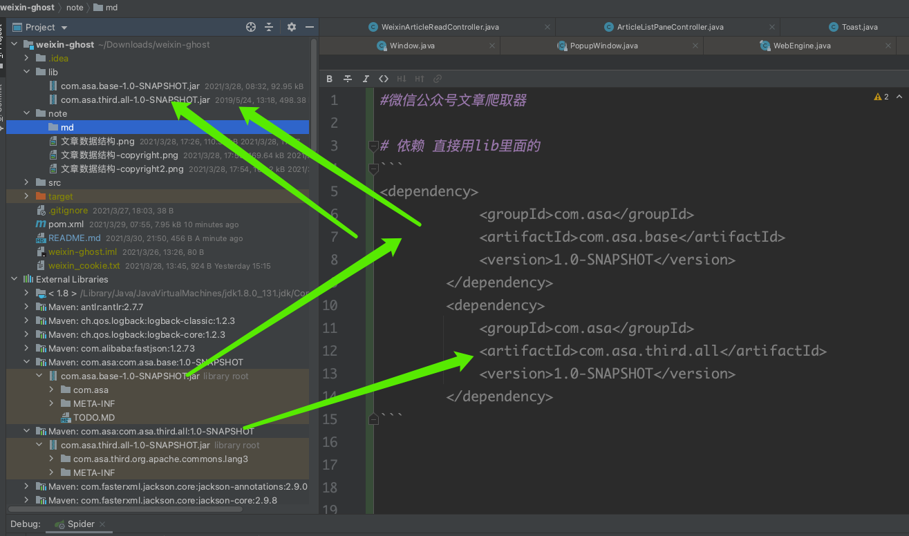

#微信公众号文章爬取器

## 依赖 直接用lib里面的 
```
<dependency>
            <groupId>com.asa</groupId>
            <artifactId>com.asa.base</artifactId>
            <version>1.0-SNAPSHOT</version>
        </dependency>
        <dependency>
            <groupId>com.asa</groupId>
            <artifactId>com.asa.third.all</artifactId>
            <version>1.0-SNAPSHOT</version>
        </dependency>
```
<p align="center"> 

</p>

## 相关界面


## 依赖安装
###1: chromedriver+selenium+chrome 自动化登录微信获取cookie
###1.1: [selenium](https://www.selenium.dev/documentation/en/)
###2: [pdfwriterformac](https://www.jianshu.com/p/55633dae3ec3)

 

