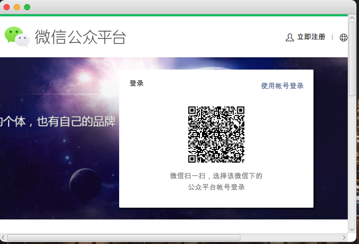
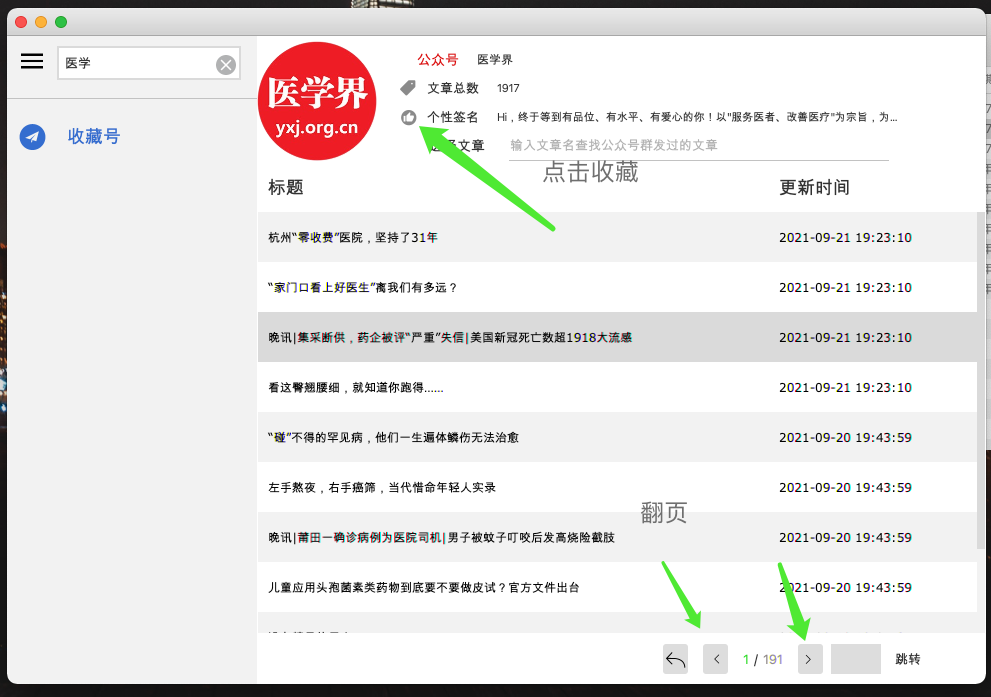
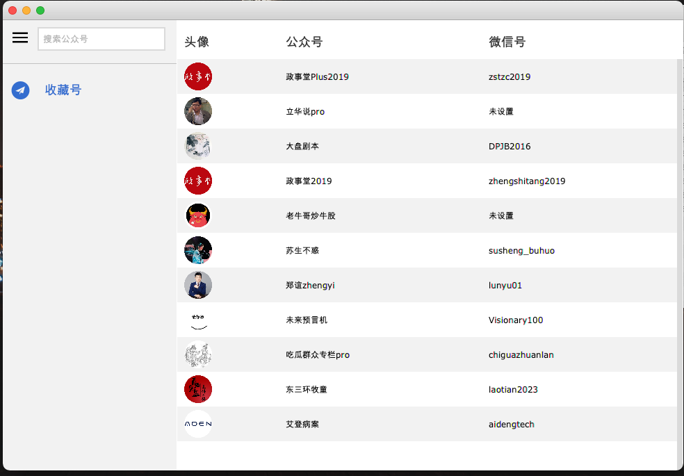
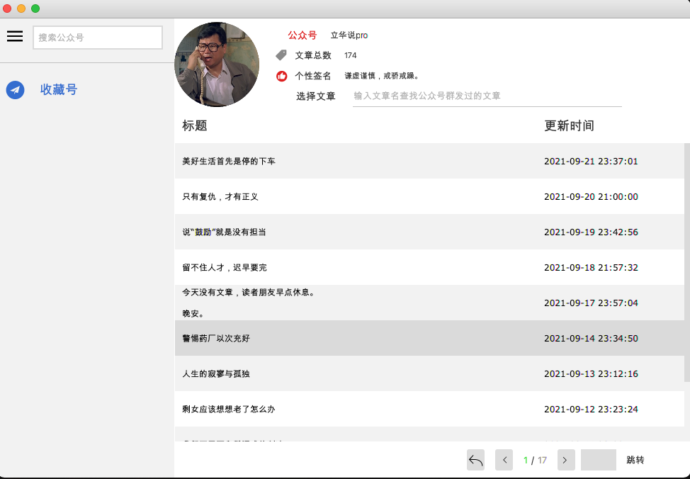
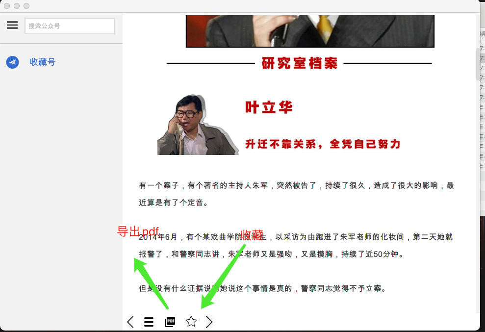

#微信公众号文章爬取器
一开始想做的是文章公众号全部文章导出pdf，但是后面做的有点多
内嵌了一个浏览器，pdf导出等，只放出部分代码，因为只是业余代码，有需要
的可以在此基础上进行定制。

## 依赖 直接用lib里面的 
```
<dependency>
            <groupId>com.asa</groupId>
            <artifactId>com.asa.base</artifactId>
            <version>1.0-SNAPSHOT</version>
        </dependency>
        <dependency>
            <groupId>com.asa</groupId>
            <artifactId>com.asa.third.all</artifactId>
            <version>1.0-SNAPSHOT</version>
        </dependency>
```

## 微信相关界面
###

#### 扫描登录：


#### 搜索公众号


#### 公众号界面


#### 收藏号界面


#### 文章列表界面


#### 文章列表界面



## bilibili相关

 

